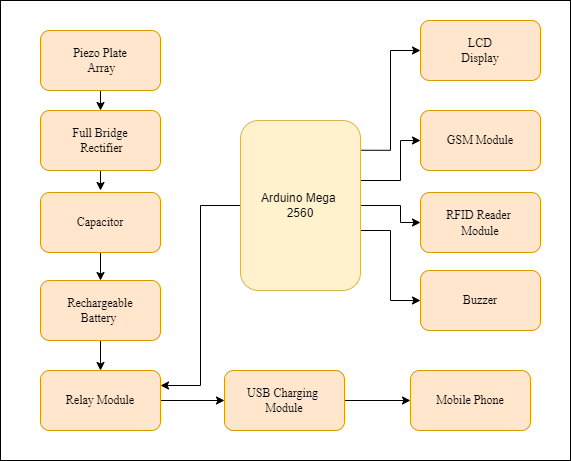
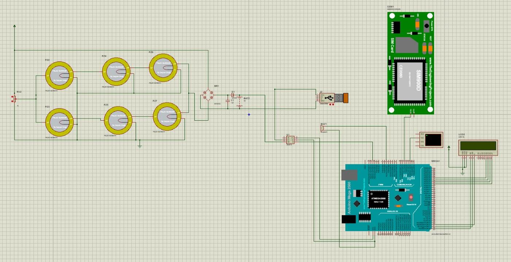
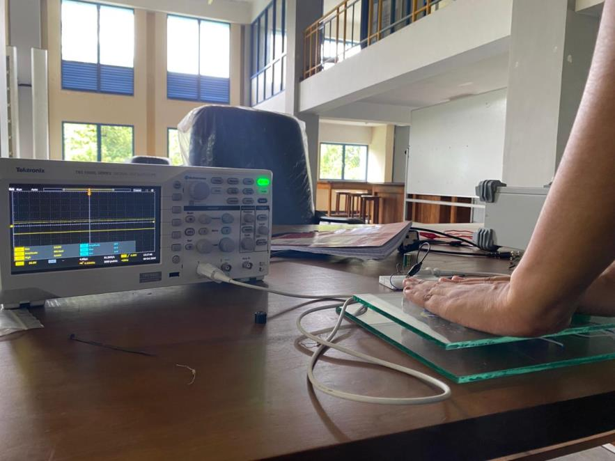
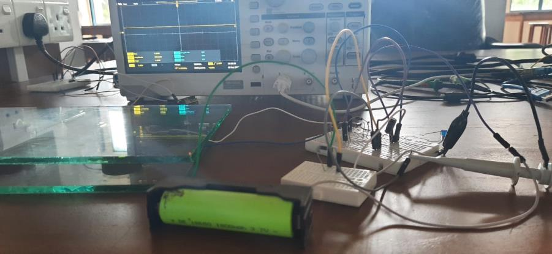
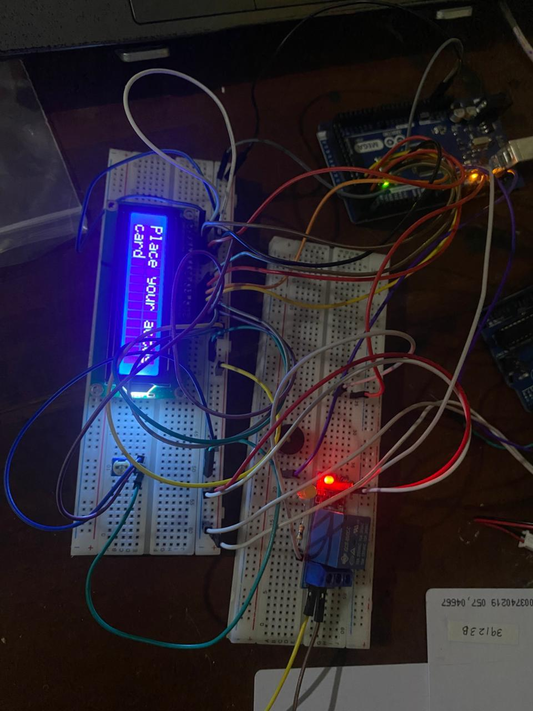
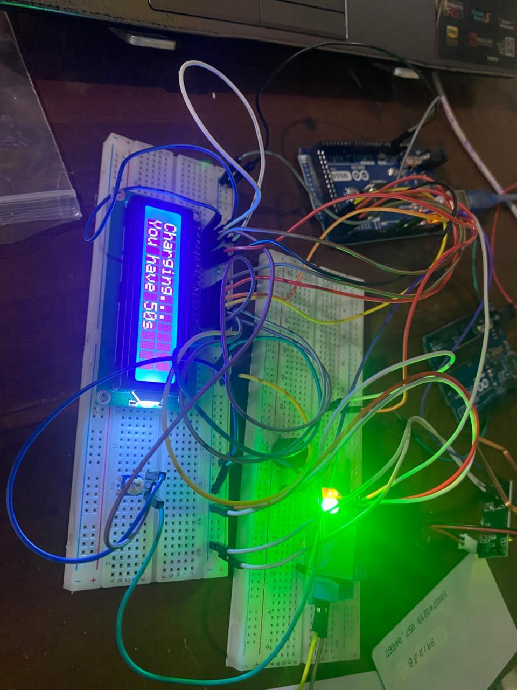
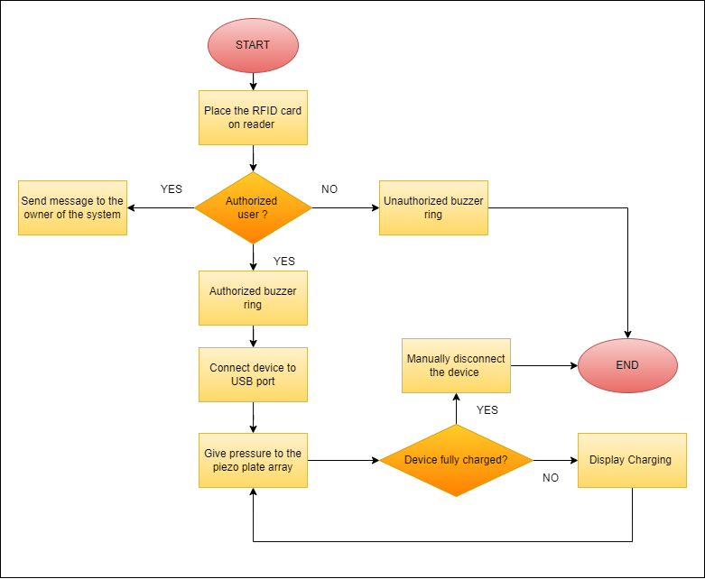

<!-- ---------------------------------------------------------------- -->
<!-- ⚡ PROJECT HEADER -->
<!-- ---------------------------------------------------------------- -->

<h1 align="center">
  
    
  <br>
  ⚡ <span style="color:#007acc">Advanced RFID-Based Footstep Power Harvesting and Charging System</span> ⚡  
</h1>

<h3 align="center">🔋 A Smart Energy Solution Utilizing Piezoelectric Technology and RFID Integration</h3>

<p align="center">
  <em>Designed and Developed as a Embedded Systems Project</em>  
</p>

<p align="center">
  
  
  
  
  
</p>


---

## 🧠 Project Overview  

> The **Advanced RFID-Based Footstep Power Harvesting and Charging System** is a smart, sustainable solution that converts **mechanical footstep pressure** into **electrical energy** using **piezoelectric transducers**.  
> It integrates **RFID-based authentication** to ensure only authorized users can access the charging feature, and **GSM-based notifications** for real-time alerts and monitoring.  

---

### ⚡ Highlights  

- 🦶 **Energy Harvesting:** Utilizes piezoelectric discs to convert foot pressure into usable electrical energy.  
- 🧩 **RFID Authentication:** Ensures **secure access control**, allowing only verified users to charge their devices.  
- 📱 **GSM Communication:** Sends SMS updates about charging status and system notifications.  
- ⚙️ **Embedded System Design:** Combines sensors, controllers, and communication modules for an integrated IoT-ready design.  
- 💻 **User Feedback System:** Displays real-time charging and access status via **16×2 LCD** and **buzzer indicators**.  
- 🔋 **Efficient Power Management:** Implements rectifier, regulator, and rechargeable battery modules for stable 5V DC output.  

---

---

## ⚙️ Problem Statement  

In the modern world, where energy demand continues to rise, generating sufficient and sustainable power for portable and public-use devices remains a challenge. This project aims to overcome this limitation through a **renewable, user-authenticated, footstep-powered energy harvesting system**.  


### 🔋 Key Challenges Addressed  

- 🌍 **Rising Energy Demand:**  
  Traditional power sources are limited and insufficient to meet the growing needs of portable devices in public spaces.  

- 🦶 **Energy Wastage from Human Movement:**  
  Everyday kinetic energy from footsteps is lost without utilization, despite its vast potential for renewable generation.  

- 🔐 **Need for Controlled Access:**  
  Public charging stations face misuse and overload; integrating **RFID authentication** ensures that only **authorized users** can access the stored energy.  

- ⚡ **Lack of Self-Sustaining Systems:**  
  Most power systems rely on external sources — this project focuses on **harvesting clean energy** from footstep pressure using **piezoelectric sensors**.  

- 🔄 **Portability and Reliability:**  
  Developing a **self-powered, maintenance-free solution** suitable for both **indoor and outdoor environments**.  

---

## 🎯 Core Objectives  

The **Advanced RFID-Based Footstep Power Harvesting and Charging System** focuses on transforming human kinetic energy into renewable electrical power — with smart access control and efficient energy utilization.  

### ⚡ Project Objectives  

1. 🦶 **Harvest Mechanical Energy**  
   Capture and convert kinetic energy from footsteps using **piezoelectric transducers** for renewable power generation.  

2. 🆔 **RFID-Based User Authentication**  
   Integrate **RFID modules** to allow only authorized users to access the generated energy for secure charging.  

3. 🔋 **Energy Regulation & Storage**  
   Use **rectifier circuits and rechargeable batteries** to regulate voltage and store energy for later use.  

4. 📟 **Real-Time Monitoring & Alerts**  
   Provide immediate **visual and audio feedback** through an **LCD display** and **buzzer indicators**.  

5. 📱 **Smart Charging Notifications**  
   Send **SMS notifications via GSM module** to inform users when their devices are charging or when energy is low.  

6. ⚙️ **Optimize System Efficiency**  
   Design an embedded system that ensures **minimal energy loss** and **maximum output efficiency** under real-world conditions.  

---

## 🔩 System Architecture  

### 🧭 Block Diagram  

<p align="center">
  
</p>

---

### 🧱 **Block Description**

| ⚙️ **Component** | 🧩 **Function** |
|------------------|----------------|
| **🦶 Piezoelectric Sensor Array** | Converts mechanical stress from footsteps into electrical voltage (AC). |
| **🔁 Bridge Rectifier + Capacitor** | Converts AC to DC and smoothens the output waveform. |
| **⚡ Voltage Regulator (LM7805)** | Maintains a stable 5V DC supply to protect circuits and battery. |
| **🔋 Rechargeable Battery** | Stores harvested electrical energy for later use. |
| **🆔 RFID Module (RDM6300)** | Authenticates users with unique RFID card IDs before allowing access. |
| **🧠 Microcontroller (ATmega2560)** | The brain of the system — controls relays, LCD, buzzer, and GSM logic. |
| **🔌 Relay Driver** | Acts as an electronic switch to enable or restrict charging output. |
| **💡 LCD Display (16x2)** | Displays user information and real-time charging status. |
| **📶 GSM Module (SIM900)** | Sends SMS alerts and charging notifications to authorized users. |
| **🔋 USB Output Module** | Provides regulated 5V DC output for device charging. |

---

## 💻 Circuit Simulation  

<p align="center">
  
</p>

Simulated using **Proteus Design Suite**, validating the following key functionalities:

- 🔄 **Data Flow Verification:** UART communication between **RFID → MCU → LCD**.  
- ⚙️ **Rectification Accuracy:** Ensures stable DC conversion and voltage regulation.  
- 🔔 **Control Logic Testing:** Validates relay switching, buzzer alerts, and status indication.  
- ⚡ **Energy Flow Validation:** Confirms proper charging path and efficient energy storage.  

---


## 🔬 Hardware Implementation  

### ⚙️ Power Generation and Rectification  

<p align="center">
  
</p>

The **Piezoelectric Sensor Array** is connected in a **hybrid (parallel + series)** configuration to achieve optimal voltage output.  
Consistent human footsteps generate approximately **5–7V DC**, which is later stabilized and rectified for safe charging.

---

### 🔋 Battery Charging Verification  

<p align="center">
  
</p>

The generated energy is stored in a **rechargeable Li-ion cell**, ensuring reusable, sustainable power.  
Charging voltage and current were verified using an **oscilloscope**, confirming a smooth and regulated DC waveform.

---

### 💳 RFID & LCD Integration  

<p align="center">
  
</p>

The **RFID Reader (RDM6300)** authenticates users by reading their unique RFID card IDs.  
Upon successful authentication, the **microcontroller (ATmega2560)** grants charging access and updates the **LCD display** accordingly.

---

### ⚡ Charging Display  

<p align="center">
  
</p>

The **LCD module** provides live charging status updates and user authentication results in real time.  
This ensures complete transparency and user feedback during the energy transfer process.


---

## 🧠 Firmware Design  

### 🧩 Firmware Flow  

<p align="center">
  
</p>

The firmware logic is designed for **real-time decision-making and automated energy control**.  
It handles everything from sensor input to user authentication, output management, and system feedback.  

---

### 🧱 Firmware Architecture  

| 🧠 **Layer** | ⚙️ **Function** |
|---------------|----------------|
| **Hardware Abstraction Layer (HAL)** | Manages GPIO, UART, LCD, and RFID drivers. |
| **RFID Interface Layer** | Validates RFID frames and extracts tag IDs from the RDM6300 reader. |
| **Control Logic Layer** | Authenticates user IDs, triggers relays, buzzers, and GSM communication. |
| **Application Layer** | Updates LCD, sends SMS notifications, and manages timeout conditions. |

---

### 🧾 Firmware Code Snippet  

```c
#define ACCESS_GRANTED_TAG_ID 0x39123B

if (tag_id == ACCESS_GRANTED_TAG_ID) {
    Lcd_displayMessage("Access Granted");
    PORTE &= ~(1 << RELAY_PIN); // Enable charging
    _delay_ms(50000);
    PORTE |= (1 << RELAY_PIN);  // Disable after timeout
    Lcd_displayMessage("Charging Complete");
} else {
    Lcd_displayMessage("Access Denied");
    PORTE |= (1 << READ_LED_PIN);
}

```

## 🧠 Key Features  

| ⚙️ **Feature** | 🔍 **Description** |
|----------------|--------------------|
| ⚡ **Energy Source** | Converts **foot pressure** into usable electrical energy using the **Piezoelectric effect**. |
| 🆔 **Authentication** | Ensures secure access through **RFID (RDM6300 / EM18)** authentication modules. |
| 🧠 **Controller** | Powered by the **Arduino Mega 2560**, controlling logic, relay, and output management. |
| 🔋 **Storage** | Energy is stored in a **rechargeable 3.7V Li-ion battery** for later use. |
| 💻 **Display** | A **16×2 LCD module** displays system status, user verification, and charging updates. |
| 🔔 **Alert System** | Integrated **buzzer** and **GSM notifications** alert users about charging events. |
| 🔌 **Charging Output** | Provides a **stable 5V regulated USB output** for mobile device charging. |
| 🔐 **Security** | Allows **authorized users only** via unique RFID tag identification. |

---

## 🧰 Technologies & Components  

| 🔩 **Component** | 🧩 **Purpose** |
|------------------|----------------|
| ⚙️ **Arduino Mega 2560** | Core microcontroller managing all system operations. |
| 🆔 **RDM6300 RFID Module** | Authenticates users before enabling charging. |
| 📱 **GSM SIM900 Module** | Sends SMS notifications for charging status and alerts. |
| 🦶 **Piezoelectric Discs (×6)** | Harvests mechanical energy from footsteps. |
| 🔁 **Full Bridge Rectifier** | Converts AC output from piezo discs into DC. |
| 🔋 **Rechargeable Li-ion Battery (3.7V)** | Stores harvested energy for continuous use. |
| 🔌 **USB Output Module** | Provides 5V DC regulated charging output. |
| 💡 **LCD 16×2 Display** | Displays user status, voltage readings, and system activity. |
| 🔔 **Buzzer & Relay** | Provides audible alerts and switching control. |

---

## 📈 Results  

The **Advanced RFID-Based Footstep Power Harvesting and Charging System** successfully achieved all its intended goals through systematic testing and hardware validation.  

| ✅ **Test Parameter** | ⚙️ **Result / Observation** |
|------------------------|-----------------------------|
| 🦶 **Footstep Energy Harvesting** | Successfully generated **5–7V DC** from consistent human footsteps. |
| 🔋 **Battery Charging Verification** | Verified through **oscilloscope readings**, ensuring smooth DC charging. |
| 🆔 **RFID Authentication** | Accurately recognized authorized users using RFID tags (RDM6300). |
| 📱 **GSM Notification System** | Sent real-time **SMS alerts** confirming charging status. |
| ⚡ **Charging Output** | Achieved a **regulated 5V USB output**, capable of powering mobile devices. |

---


## 🌱 Future Enhancements  

> To make the system more scalable, intelligent, and eco-friendly, the following improvements are envisioned:

- ⚙️ **Integrate Supercapacitors** – Enhance energy storage capacity for long-term use.  
- 🔐 **Advanced RFID Security** – Employ encrypted RFID tags for secure user verification.  
- 🏙️ **Public Deployments** – Expand system usage to **bus stands, parks, malls**, and **university walkways**.  
- 🌐 **IoT-Enabled Analytics** – Implement **IoT dashboards** to remotely track energy generation and consumption.  
- ⚡ **Efficiency Optimization** – Upgrade rectifier and regulator circuits for higher energy conversion rates.  

---

## 📚 References  

1. 📘 **A. Babu**, *“Advanced Footstep Power Generation System”*, Instructables, 2017.  
2. 📗 **S. Panghate**, *“Advanced Footstep Power Generation System using RFID for Charging”*, IRJET, 2020.  
3. 📙 **Datasheet References:**  
   - ATmega2560 Microcontroller – *Atmel Corporation*  
   - RDM6300 RFID Reader – *RFID Technology Ltd.*  
   - SIM900 GSM Module – *SIMCom Wireless Solutions*  

---
<h4 align="center">💚 "Harvesting Every Step — Powering the Future, Securely and Sustainably." 💚</h4>
